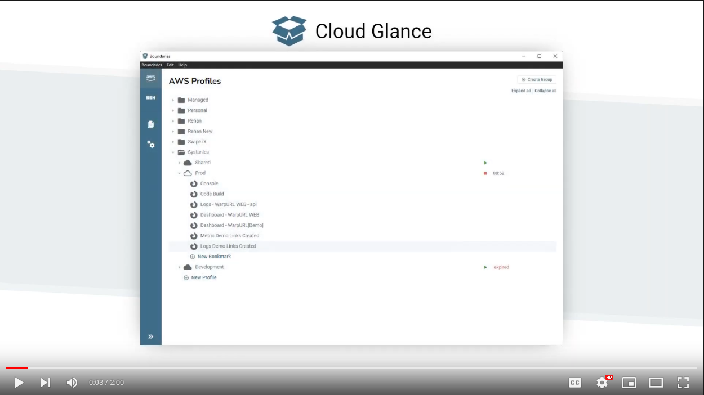

# CloudGlance - Community, Releases and Issues

CloudGlance helps you Navigate your AWS Environments with ease. It is a single pane of glass for all your 
AWS credentials and bastion hosts.

CloudGlance lives at [cloudglance.dev](https://cloudglance.dev/).

You can find the following here:

- [Issues](https://github.com/Systanics/CloudGlance/issues) - Search previous issues or log a new issue.
- [Downloads/Releases](https://github.com/Systanics/CloudGlance/releases) - Download the latest versions of CloudGlance (the auto updater does not working for all installation types).
- [Discussions](https://github.com/Systanics/CloudGlance/discussions) - Ask questions, feature requests, view the FAQ and read important announcements. 
